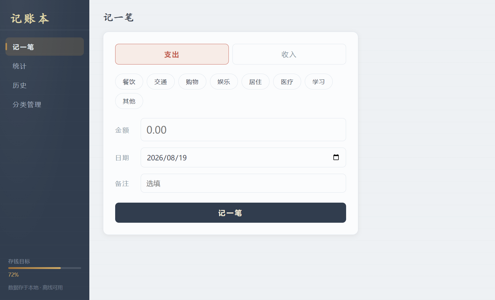
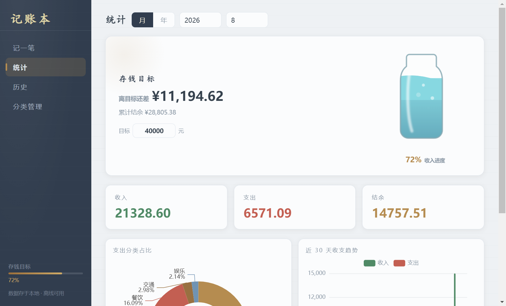
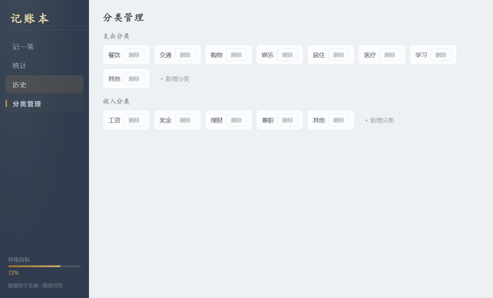

# 记账本

一个本地离线的 Windows 桌面记账应用：**双击即用、数据全在本地**，专为"存够 50 万就离职"这种长期储蓄目标设计。收入/支出随手记，图表看趋势，侧栏有存钱进度，统计页还有一只会慢慢被"存满"的玻璃储蓄罐。

## 截图

| 记账 | 统计（含存钱储蓄罐） |
| --- | --- |
|  |  |

| 历史 | 分类管理 |
| --- | --- |
|  |  |

## 功能

- **记账**：支出/收入二选一，常用分类 + 自定义分类，金额、日期、备注
- **统计**：本月收支汇总、支出分类占比饼图、近 30 天每日收支趋势
- **存钱目标**：目标金额可改（默认 50 万），按**累计结余**计算进度，储蓄罐加水动画
- **历史**：按时间/类型/分类筛选，支持修改、删除
- **分类管理**：内置常用分类，可新增、改名、删除

## 技术栈

| 层 | 选型 |
| --- | --- |
| 桌面框架 | Electron 33 |
| 渲染 | 原生 HTML/CSS/JS（无框架） |
| 图表 | ECharts 5（本地打包，不联网） |
| 存储 | JSON 文件（`data.json`，无原生依赖） |
| 打包 | electron-builder（portable 免安装 exe） |

> 存储为什么用 JSON：最初考虑 better-sqlite3，但目标机器缺 VS Build Tools 编译不了原生模块，换成本地 JSON 文件，对记账数据量完全够用，且真正"绿色便携"。

## 项目结构

```
├── main.js                 # 主进程：窗口、IPC、数据目录决策
├── preload.js              # contextBridge 桥接（隔离环境）
├── store.js                # 数据层：JSON 读写 + 分类/记录/统计
├── renderer/
│   ├── index.html          # 页面结构
│   ├── style.css           # 账本纸面 + 墨蓝晨雾主题
│   ├── app.js              # 渲染逻辑 + ECharts
│   └── echarts.min.js      # 本地图表库
├── build/
│   ├── icon.ico            # 应用图标
│   └── generate-icon.js    # 图标生成脚本（纯 Node，无依赖）
└── docs/superpowers/specs/ # 设计文档
```

## 快速开始

```bash
# 安装依赖
npm install

# 开发运行
npm start

# 打包便携版 exe（输出到 dist/）
npm run dist
```

## 数据说明（重要）

- 数据保存在 **exe 同目录**的 `data.json`，整文件夹拷走，数据跟着走（绿色便携）
- 首次运行自动创建 `data.json` 并写入内置分类
- 若 exe 所在目录无写权限，会弹窗提示你选一个数据目录
- `data.json` 包含你的全部账目，**请勿提交到 GitHub**（已加入 .gitignore）

## 打包注意事项

- 图标：应用使用 `build/icon.ico`（由 `build/generate-icon.js` 生成，纯 Node 无需任何图像库）
- 若 `npm run dist` 在无外网/访问不了 GitHub 的环境下失败，是因为 electron-builder 要下载 Electron、NSIS 等工具，可参考 `docs/开发注意事项.md` 的离线打包方案
- 修改了 `main.js` / `store.js` 等源码后重新打包，**务必检查 `package.json` 的 `build.files` 是否覆盖了新增文件**（曾因漏打包 `store.js` 导致 exe 报错）

## 许可

仅作个人学习 / 自用开源分享，无商业授权限制。